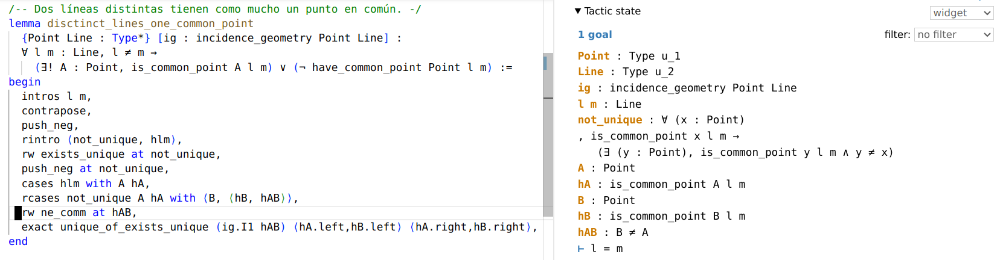

# Formalización de las matemáticas con Lean. Un caso de estudio: Geometría euclídea plana.

[Código fuente](./src) y [memoria](./memoria/memoria.pdf) del Trabajo de Fin de Grado del grado en Matemáticas de la Universidad Complutense de Madrid. 

**Observación**: la forma más rápida de acceder a un entorno de desarrollo
preconfigurado y con el código de este repositorio es utilizando el servicio en
línea *gitpod*. Se puede acceder a este entorno desde [este enlace](https://gitpod.io/#/https://github.com/haztecaso/euclidean-geometry-lean).

[id]:https://www.url.com "https://www.url.com"

## Organización del repositorio

En la carpeta [`/memoria`](./memoria/) se encuentran la
[memoria](./memoria/memoria.pdf) y la [presentación](./memoria/presentacion.pdf)
del trabajo.

En la carpeta [`/src`](./src/) se encuentra el código fuente del trabajo en Lean
3, en el que se implementan definiciones y demostraciones de la axiomatización
de Hilbert de la geometría euclídea plana. Los ficheros están organizados
siguiendo la estructura de la geometría de Hilbert:

- La carpeta [`incidence_geometry`](./src/incidence_geometry/) contiene
  resultados relativos a la relación de incidencia.
  - El fichero [`basic.lean`](./src/incidence_geometry/basic.lean) contiene los 
  axiomas de incidencia, definiciones básicas y resultados elementales.
  - El fichero [`propositions.lean`](./src/incidence_geometry/propositions.lean) 
  contiene proposiciones de la geometría de incidencia.
- La carpeta [`order_geometry`](./src/order_geometry/) contiene resultados 
  relativos a la relación de orden.
  - El fichero [`basic.lean`](./src/order_geometry/basic.lean) contiene los 
  axiomas de orden, definiciones básicas y resultados elementales. Aquí se 
  definen objetos clave para el desarrollo posterior de la teoría:
    - Segmentos
    - Triángulos
    - Rayos
    - Ángulos 
  - El fichero [`propositions.lean`](./src/order_geometry/propositions.lean) 
  contiene proposiciones de la geometría del orden.
  - El fichero [`sideness.lean`](./src/order_geometry/sideness.lean) contiene 
  definiciones y resultados sobre dos relaciones de equivalencia que definen los 
  conceptos de *lados de una línea respecto de un punto* y *lados del plano 
  respecto de una línea*.
- La carpeta [`congruence_geometry`](./src/congruence_geometry/) contiene un
  solo fichero, [`basic.lean`](./src/congruence_geometry/basic.lean), en el que
  se definen los axiomas de las relaciones de congruencia entre segmentos y
  congruencia entre ángulos. Además se demuestra que estas relaciones son de
  equivalencia.
- El fichero [`parallels_independence.lean`](./src/parallels_independence.lean)
  contiene esquemas de código en los que se plantean formalizaciones de la
  independencia del axioma de las paralelas del resto de axiomas.

## Cómo instalar Lean y ejecutar el código

### Entorno en línea

Como comentado más arriba la forma más rápida de acceder a un entorno de
desarrollo preconfigurado y con el código de este repositorio es utilizando el
servicio en línea *gitpod*. Se puede acceder a este entorno desde [este
enlace](https://gitpod.io/#/https://github.com/haztecaso/euclidean-geometry-lean).

### Instalación local

En [la web de la comunidad de Lean
3](https://leanprover-community.github.io/get_started.html) se encuentran las
instrucciones de instalación de Lean 3, mathilb, leanproject y configuración del
entorno de desarrollo. Una vez instalado el lenguaje y estas herramientas, se
puede obtener una copia local de este repositorio ejecutando el comando `git
clone https://github.com/haztecaso/euclidean-geometry-lean`. 

El editor de texto recomendado para trabajar con Lean es Visual Studio Code (es
recomendable usar su distribución open source,
[VSCodium](https://vscodium.com/)).
